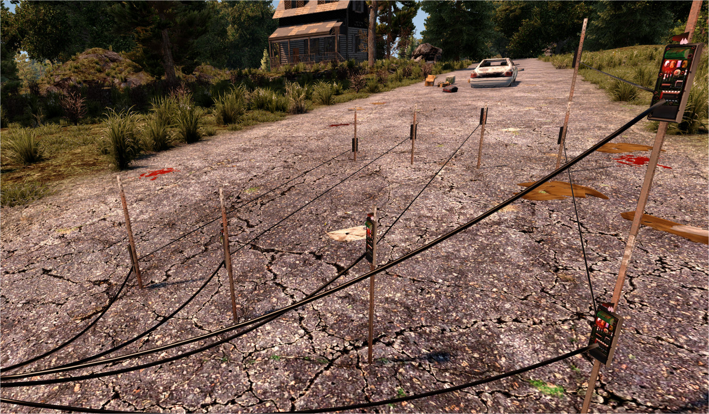
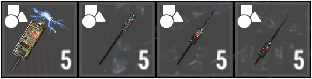

# OCB Electricity Half Fence Post - 7 Days to Die (A20) Addon

Small XML modlet adding a one block tall electric fence post with
three version that differ in the height where the shock wire is
connected (low, middle and top). These fence posts can also be
stacked, so you can build a massive wall if you want :)

This mod changes the regular electric fence post into a
multi-variant helper, so you need to hold "R" to choose
the variations you want to build.

Some may say that this will make these fences too powerful, but
you can basically already achieve the same thing with the vanilla
fence post, but you have to get creative and it doesn't really look
well and right (like attaching posts horizontally to walls or rebars).

[![GitHub CI Compile Status][3]][2]

### Picking up blocks

Once you pick up a block you will get the actual variant back instead
of the generic helper block. I already fixed this issue in another mod,
but this would make this mod EAC incompatible. If you don't mind disabling
EAC, you may just install [OCB Remote Turret Control][4] ([Nexus][5])
too, in order to also profit from that fix.

[4]: https://github.com/OCB7D2D/OcbRemoteTurretControl
[5]: https://www.nexusmods.com/7daystodie/mods/2279

### Download and Install

Simply [download here from GitHub][1] and put into your A20 Mods folder:

- https://github.com/OCB7D2D/ElectricityHalfFencePost/releases

## Changelog

### Version 0.2.2

- Add automated translations for 27 languages via DeepL

### Version 0.2.1

- New variant reusing vanilla power relay

### Version 0.2.0

- Initial working version

## Compatibility

I've developed and tested this Mod against version a20.b5.

[1]: https://github.com/OCB7D2D/ElectricityHalfFencePost/releases
[2]: https://github.com/OCB7D2D/ElectricityHalfFencePost/actions/workflows/ci.yml
[3]: https://github.com/OCB7D2D/ElectricityHalfFencePost/actions/workflows/ci.yml/badge.svg
